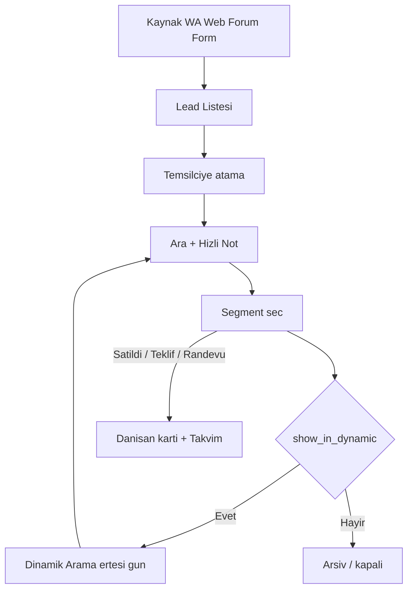

# Nefalix CRM — Estesoft Stella Kopyası (Plan / Claude Spec)

> **Ne bu?** Medident Stella mantığının Nefalix’te kopyası için plan + ekran spec.  
> **Kullanım:** Bu dosyayı Claude’a ver → HTML UI mock üret. Kod/API burada yok.  
> **Kaynak:** Stella ekranları 15.07.2026 + Medident operasyon anlatımı.  
> **Referans:** `https://medidentistanbul.stellamedi.com`

---

## 0. Özet

| Konu | Karar |
|------|--------|
| Ne | Stella iş mantığı = Nefalix Clinic CRM |
| P0 | Lead → atama → not → **segment** → **Dinamik Arama** → Danışan kartı → Randevu |
| P1 | Kasa / gider · WhatsApp panel |
| P2 | Raporlar · Salesline · derin sistem |
| MVP dışı | Obezite, TTB, stok, puan, diyetisyen, göz, tahlil, transfer/konaklama derinliği |
| UI | Türkçe · mock data · API sonra |
| Bu doc | Sadece plan + screen spec (Claude için) |

---

## 1. Üst menü (Stella)

`CRM` · `DANIŞAN` · `RANDEVU` · `GELİRLER` · `GİDERLER` · `WHATSAPP` · `RAPOR` · `SİSTEM` · `DESTEK`  
(+ 🏠 · global arama · bildirim · dil · profil)

### CRM alt
Yeni Lead · Lead Listesi · Salesline · **Dinamik Arama** · Dinamik Arama–Havuz · Lead Dönüşüm Geçmişi · Lead Takibi · CRM Ayarları

### DANIŞAN alt
Yeni Danışan · Danışan Listesi · Yeni Teklif · Teklifler · Notlar & Görevler · Şikayetler

### RANDEVU alt
Yeni Randevu · **Takvim** · Randevu Listesi · Etkinlikler · Transfer Takvimi

### GELİRLER alt
Yeni Satış · Kasa · Satış Listesi · Bakiye Listesi · Banka Özet · Faturalar · Gelirler

### WHATSAPP alt
Yönetim Paneli · Raporlar · Meta Yönetim  
(Yönetim sekmeleri: hesaplar · template · template tercih · otomatik yanıt · otomatik atama · ayarlar)

### SİSTEM alt
Yetki · Ayarlar · Güvenlik · Personel · Prim · Entegrasyonlar · API Yönetimi · Hizmet · Paket · Ürün · Tanımlamalar · Toplu SMS Onayları

---

## 2. Segment kataloğu (ekrandan doğrulanmış)

Danışan kartı → Notlar → segment dropdown (Medident gerçek liste):

| code | label | Dinamik Arama’da mı? |
|------|-------|----------------------|
| mesajlasiliyor | Mesajlaşılıyor | Evet |
| orta_vadede | Orta Vadede Düşünecek | Evet |
| otel_satis | Otel Satış | Hayır (kapanış) |
| potansiyel | Potansiyel | Evet |
| revizyon | Revizyon | Evet |
| rontgen_foto | Röntgen ve Fotoğraf Gönderecek | Evet |
| satildi | Satıldı | Hayır |
| sicak | Sıcak Alacak | Evet |
| sureci_biten | Süreci Biten | Hayır |
| takip | Takip | Evet |
| tedaviye_uygun_degil | Tedaviye Uygun Değil | Hayır |
| teklif_verildi | Teklif Verildi | Evet |
| tekrar_gelen | TEKRAR GELEN LEAD | Evet |
| ulasilamadi | Ulaşılamadı-Tekrar Aranacak | Evet (ertesi gün zorunlu) |

**Not kaydı = not metni + (opsiyonel tarih) + segment + Kaydet.**  
Segment değişince ertesi gün Dinamik listeye düşer (dinamik=Evet olanlar).

Diğer UI durumları (segment değil): `Potansiyel Hasta` (kart tipi/badge), `YENİ DATA` (liste ikonu) — ihtiyaç halinde ayrı status alanı.

---

## 3. Kritik süreç



1. Lead gelir → Lead Listesi  
2. Atama (ör. Abdülkadir)  
3. Ara → Hızlı Not + Segment  
4. Dinamik=Evet → ertesi gün Dinamik Arama / Havuz  
5. Ulaşılamadı her gün yeniden listede  
6. İlerleyen kayıt → Danışan kartı + Randevu / Satış / Teklif

---

## 4. Claude Screen Specs (öncelikli 3 ekran)

### SPEC-1 — Dinamik Arama

**Route:** `/clinic-crm/dynamic`  
**Stella:** CRM → Dinamik Arama

**Üst bar**
- Başlık: Dinamik Arama
- İşlemler (dropdown)
- Arama kriterleri (açılır filtre)
- SMS gönder · E-Posta gönder · Ara (primary)

**Tablo kolonları (soldan sağa)**
1. Dosya no  
2. Ülke (bayrak)  
3. Danışan (ad)  
4. Telefon  
5. Segment (ikon + label)  
6. Satış temsilcisi  
7. Referans kaynağı  
8. Kayıt tarihi  
9. Değişiklik tarihi  
10. İşlemler (detay · not · işaret · bayrak)

**Mock satır örnekleri**
| Danışan | Segment | Temsilci | Kaynak |
|---------|---------|----------|--------|
| ARİF | Teklif Verildi | Enes Ceylan | WHATSAPP TR-medident |
| Erkan Arıcı | Ulaşılamadı-Tekrar Aranacak | Enes Ceylan | WHATSAPP TR-medident |
| Salih Okatan | Röntgen ve Fotoğraf Gönderecek | Enes Ceylan | WHATSAPP TR-medident |

**Havuz varyantı:** `/clinic-crm/dynamic/pool` — aynı tablo; atanmamış veya havuz kuralı.

---

### SPEC-2 — Danışan kartı (Detaylar)

**Route:** `/clinic-crm/clients/:id`  
**Stella örnek:** customer UUID / ARİF `#11141`

**Header**
- Avatar · Ad · ülke bayrağı · ID `[# 11141]` · Telefon  
- Hızlı İşlemler: Yeni Not/Görev · Yeni Teklif · Yeni Randevu · Yeni Satış

**Sol sidebar**

| Menü | MVP mock | Sonra |
|------|----------|-------|
| Detaylar | Evet (aktif) | |
| Düzenle | Evet (shell) | |
| Formlar | | Sonra |
| Teklif | Evet | |
| Randevu | Evet | |
| Notlar | Evet | |
| İşlem Kartları | | Sonra |
| Dosya & Fotoğraf | Evet (shell) | |
| Satış & Tahsilat | Evet (shell) | |
| Faturalar | | Sonra |
| Puan | | Sonra |
| Paket Takibi | | Sonra |
| İletişim | Evet (shell) | |
| Tanılar | | Sonra |
| Transfer & Konaklama | | Sonra |
| Diyetisyen / Obezite / Reçete / Tıbbi / Diş / Göz / Tahliller | | Sonra (MVP dışı) |

**Orta kolon — İşlemler**
- Avatar · badge `Potansiyel Hasta`
- WhatsApp sohbeti başlat · Düzenleme geçmişi · Medikal kayıt indir · Dosya No Değiştir · Sil
- + Yeni: Randevu · Satış · Teklif
- Etiketler (açılır)

**Orta kolon — Bilgi**
- Kişisel: Kayıt tarihi  
- Adres: Ülke  
- Diğer: Kayıt açan · **Segment** · Referans kaynağı · Satış temsilcisi · Lead kayıt tarihi · Düzenleyen · Değişiklik tarihi

**Sağ kolon — Notlar**
- Hızlı Not (textarea)
- Tarih (GG.AA.YYYY)
- Segment select (katalog §2)
- Kaydet
- Not geçmişi: metin · tarih · yazar · segment etiketi

**Alt sekmeler (shell):** İşlem Geçmişi · Formlar · Teklifler · Tanılar

---

### SPEC-3 — Randevu detay (Takvim modal)

**Route:** `/clinic-crm/appointments/calendar` + modal  
**Stella:** `/appointment/calendar/general`

**Takvim chrome**
- Genel Takvim · tarih · Takvim Gösterim Tipi · Renk Kaynağı · İşlemler  
- Grid’de renkli randevu blokları (ör. `17:00 Sevda Emel Korkmaz`)

**Modal alanları**
| Alan | Örnek |
|------|-------|
| Durum | Beklemede (select) |
| Aksiyonlar | Hızlı Düzenle · İşlemler |
| Ad Soyad | Sevda Emel Korkmaz (link → danışan kartı) |
| Dosya no | MDI-135 |
| Telefon | +4915563072884 |
| Saat | 17:00 – 18:30 |
| Hizmet | PORSELEN DİŞ KAPLAMA |
| Personel | Enes Ceylan |
| Oda | DENTALZONE Prova/Geçici Diş Randevusu |
| Randevu tipi | 2. Aşama Hastası |
| Not | serbest metin |
| Audit | kayıt tarihi · oluşturan · değişiklik · düzenleyen |
| Footer | Kapat |

**Randevu form alanları (yeni / hızlı düzenle)**  
tarih · başlangıç · bitiş · danışan · personel · oda · hizmet · durum · tip · not

---

## 5. Diğer ekranlar (kısa — Claude ikinci tur)

### Lead Listesi
Kolon: checkbox · kayıt tarihi · ülke · lead · telefon · işlemler (yönlendir)

### Danışan Listesi
Kolon: checkbox · ID · durum · ad · ülke · telefon · segment · satış temsilcisi · referans · değişiklik · kayıt · işlemler

### Gider kaydet
Kategori · Gider kalemi · Fatura no · Tarih · Tutar+para · Ödeme yöntemi · Notlar · Vazgeç/Kaydet

### Kasa / muhasebe özeti
Üst: Gelir · Gider · Net (TRY+EUR)  
Alt tablo: ödeme tarihi · danışan/firma · işlem tipi · bilgi · referans · yöntem · araç · not · tutar · işlemler  
Gider kategorileri: Klinik · Maaş/personel · Otel/transfer · Rutin şirket

### Rapor index
Kartlar: Sık kullanılanlar · Finansal · Danışan · Randevu · Sistem · Form&Anket (MVP’de ilk 3 kart linkleri yeterli)

---

## 6. Faz sırası (Claude HTML sırası)

1. Shell + üst nav  
2. **SPEC-1 Dinamik** + **SPEC-2 Danışan kartı** + Lead/Danışan listeleri  
3. **SPEC-3 Takvim + modal**  
4. Gider + Kasa  
5. WhatsApp panel shell  
6. Rapor + Sistem stub  

---

## 7. Veri modeli (Claude mock için yeterli)

```text
users: id, name, role
leads: id, name, phone, country, source, assigned_to, created_at
clients: id, file_no, name, phone, country, segment, rep, source, type_badge, lead_at, updated_at
notes: id, client_id, body, segment, at, by
appointments: id, client_id, start, end, service, staff, room, type, status, note, created_by, updated_by
segments: code, label, show_in_dynamic
transactions: type in|out, amount, currency, method, category, note, paid_at, client?
```

---

## 8. Claude’a yapıştırılacak prompt

```text
Bu MD dosyasının tamamını oku: nefalix-stella-crm-plan.md

Görev: Nefalix Clinic CRM HTML UI mock üret (vanilla HTML/CSS/JS).
API bağlama. Mock JSON ile çalışsın.

ÖNCELİK SIRASI (şimdi sadece bunları bitir):
1) Üst navigasyon shell (CRM, DANIŞAN, RANDEVU, GELİRLER, GİDERLER, WHATSAPP, RAPOR, SİSTEM, DESTEK)
2) SPEC-1 Dinamik Arama — kolonlar ve mock satırlar MD’deki gibi
3) SPEC-2 Danışan kartı — sidebar MVP menüleri + bilgi paneli + Hızlı Not + segment dropdown (tam katalog §2)
4) SPEC-3 Genel Takvim + randevu detay modal (alanlar MD’deki gibi)

Kurallar:
- Türkçe UI
- Segment listesi §2’deki tam liste; tahmin etme
- Danışan sidebar’da “Sonra” satırlarını menüde gri/disabled veya gizle — tıbbi modülleri üretme
- Stella mantığı; görsel Nefalix (mor-indigo klişesinden kaçın)
- Liste/tablo sade; hero kart clutter yok
```

---

## 9. Açık sorular (opsiyonel — HTML mock için bloklamaz)

1. Lead atamasını kim yapar? (yönetici / her temsilci)  
2. Stella migrate mi, sıfırdan mı?  
3. Saha CRM (`/crm`) ayrı mı kalsın? (varsayılan: ayrı)

~~Segment listesi~~ → çözüldü (§2)  
~~Dinamik hangi segment~~ → çözüldü (`show_in_dynamic`)

---

## 10. Repo notları

| Konu | Yol |
|------|-----|
| Bu plan | `docs/nefalix-stella-crm-plan.md` |
| Estesoft entegrasyon | `directives/estesoft_integration.md` |
| Saha CRM (ayrı ürün) | `directives/saha_crm.md` |

---

*Son güncelleme: 2026-07-15 — Dinamik + Danışan kartı + Randevu modal ekranları işlendi; Claude-only plan.*
